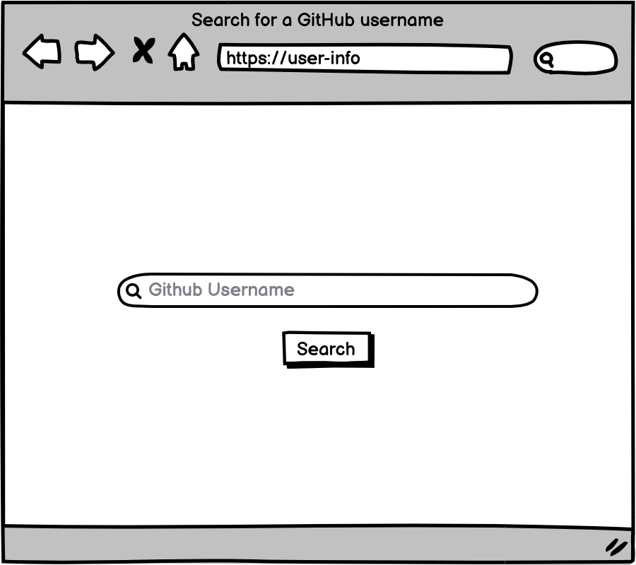
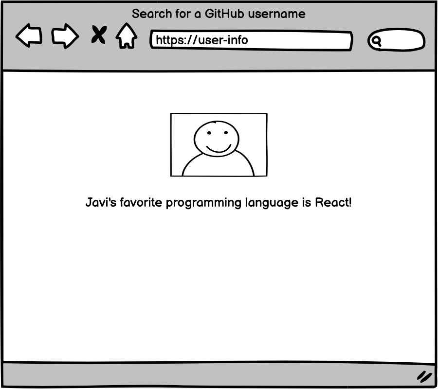

# Github   user's favourite coding language

Build a web or command line application,which should allow users to enter an arbitrary Github username,and   be   presented   with   a   best   guess   of   the   Github   user's favourite programming language.

This can be computed by using the Github API to fetch all of theuser's public Github repos, each of which includes the name ofthe dominant language for the repository.

## Documentation API

Documentation   for   the   Github   API   can   be   found   at ` https://developer.github.com/v3/`

## Stack 

- React.js
- API
- Bootstrap

## Process

- Create wireframes of the application
- Create the project
- Connect to the GitHub API
- Create a form with a search button
- Display the new information to the user
- Create desing of the app with css/bootstrap

## Mockups

 

## Screenshots

## How to run the project

- Clone this repository to your local computer
- From the terminal install all dependencies or run `npm install` or `yarn install`
- Run `npm start` or `yarn start`
- The application should be visible in the `http://localhost:3000`
